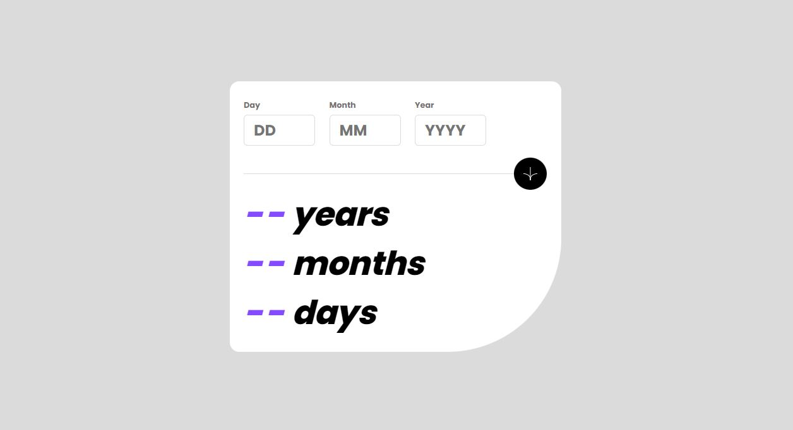

<h1 align="center">Signup Form
</h1>

 

   <a href="https://ahlam-alsaffarini.github.io/age-calculator/"> Demo 🔥🤍</a>

   Solution for a challenge from  <a href="https://www.frontendmentor.io/challenges/age-calculator-app-dF9DFFpj-Q" target="_blank">frontendmentor.io</a>.

 
 

## Overview

### The challenge

This a challenge is to build out this age calculator app and get it looking as close to the design as possible and u should be able to:.

- View an age in years, months, and days after submitting a valid date through the form
- Receive validation errors if:
  - Any field is empty when the form is submitted
  - The day number is not between 1-31
  - The month number is not between 1-12
  - The year is in the future
  - The date is invalid e.g. 31/04/1991 (there are 30 days in April)
- View the optimal layout for the interface depending on their device's screen size
- See hover and focus states for all interactive elements on the page

## My process

### Built with

- Semantic HTML5 markup
- CSS custom properties
- Flexbox
- Mobile-first workflow

### Useful resources

- [MDN](https://developer.mozilla.org/en-US/)
- [stackoverflow](https://stackoverflow.com/)

## Acknowledgments

A big thank you to anyone providing feedback on my . It definitely helps to find new ways to code and find easier solutions!
